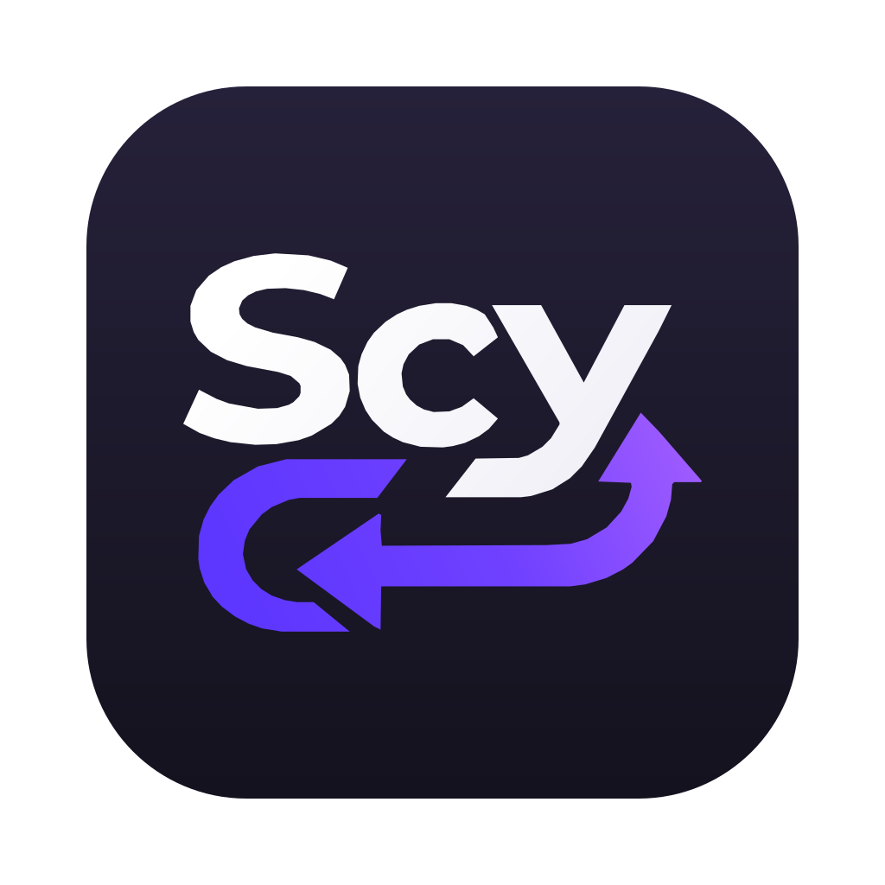
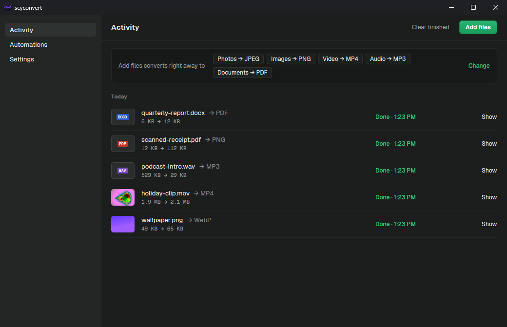
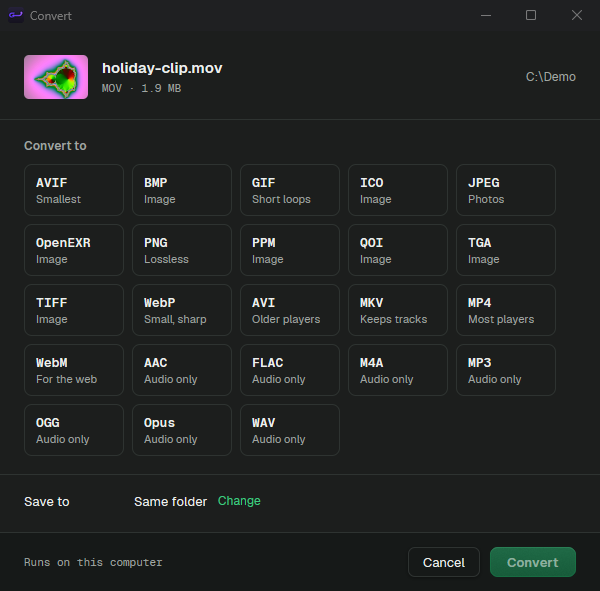

<p align="center">
  
</p>

<h1 align="center">scyconvert</h1>

<p align="center">
  <b>Right-click. Pick a format. Done.</b><br>
  A file converter that minds its own business: everything happens on your machine.
</p>

<p align="center">
  <a href="https://github.com/furkangercek/scy-convert/releases/latest"></a>
  
  
  <a href="LICENSE"></a>
</p>

<p align="center">
  
</p>

## Why does this exist?

Because "convert MOV to MP4" should not involve a sketchy website, a 200 MB upload, a cookie banner and a watermark. scyconvert does the boring part locally and quickly, then gets out of the way.

- **No uploads, no accounts, no trial, no telemetry.** It doesn't even check for updates on its own.
- **Lives in your right-click menu** on Windows and in Finder on macOS.
- **Around 40 formats** of images, video, audio, PDFs and office documents.
- **Smart routing.** No direct path between two formats? It chains up to three conversions and figures it out.
- **Comes with a CLI** for when you want to convert 900 photos at once.
- **Starts with your computer** if you want it to, minimized and out of the way.

## Install

Head to **[Releases](https://github.com/furkangercek/scy-convert/releases/latest)** and grab the file for your machine.

| You have | Download |
| --- | --- |
| Windows 10 or 11 | `scyconvert-<version>-windows-x64-setup.exe` |
| Windows, no installer | `scyconvert-<version>-windows-x64.zip` |
| Mac with Apple silicon (M1 and later) | `scyconvert-<version>-macos-arm64.dmg` |
| Intel Mac | `scyconvert-<version>-macos-x86_64.dmg` |

### Windows

1. Run the `setup.exe`. It installs just for you, so there's no admin prompt.
2. Windows SmartScreen may say it "protected your PC", because the installer isn't code-signed. Click **More info**, then **Run anyway**.
3. Leave **Add "Convert with scyconvert" to the Explorer right-click menu** checked. **Start scyconvert minimized when I sign in** keeps it ready in the taskbar (change it later under Settings > Open at login). Tick **Add the scyconvert command to PATH** if you want the CLI.
4. Right-click any file and choose **Convert with scyconvert**. On Windows 11 it's under **Show more options**.

Using the `.zip` instead? Unzip it anywhere and run `scyconvert-app.exe`. You get everything except the right-click menu.

### macOS

1. Open the `.dmg` and drag **scyconvert** into **Applications**.
2. The app isn't notarized by Apple (that costs $99 a year), so the first launch gets blocked. Right-click the app, choose **Open**, then **Open** again. If macOS still refuses, run this once in Terminal:
   ```bash
   xattr -dr com.apple.quarantine /Applications/scyconvert.app
   ```
3. For the Finder right-click entry, open **System Settings > General > Login Items & Extensions**, find scyconvert under the Finder extensions and turn it on.
4. Right-click a file in Finder, choose **Convert with scyconvert** > **Open in scyconvert…**, and pick a format. **Services** > **Convert with scyconvert** in the same menu works too.

### Office documents

FFmpeg and PDFium ship inside the app. Word, Excel and PowerPoint go through [LibreOffice](https://www.libreoffice.org/download/), which is far too big to bundle. Install it the normal way and scyconvert finds it on its own.

## Pick a format, any format

<p align="center">
  
</p>

| Kind | Formats |
| --- | --- |
| Images | JPEG, PNG, WebP, AVIF, GIF, TIFF, BMP, ICO, TGA, PPM, QOI, OpenEXR, SVG, HEIC (macOS) |
| Video | MP4, MOV, WebM, MKV, AVI, and video to GIF |
| Audio | MP3, WAV, FLAC, AAC, M4A, OGG, Opus, or rip the audio out of a video |
| PDF | Pages to PNG or JPEG |
| Documents | DOCX, DOC, ODT, RTF, TXT, HTML, PPTX, PPT, ODP, XLSX, XLS, ODS, CSV, and any of them to PDF |

Results land next to the original unless you tell it otherwise.

## For terminal people

```bash
scyconvert clip.mov --to mp4
scyconvert photos/ --to webp -r          # a whole folder, subfolders too
scyconvert scan.pdf --to png --pages 1-3
scyconvert song.wav --to mp3 -o ~/Music

scyconvert targets photo.png             # what can this file become?
scyconvert engines                       # what works on this machine
scyconvert formats                       # the full list
```

`scyconvert --help` has the rest: quality, size, DPI, video codecs and how many files to convert at once.

## Build it yourself

Windows, in PowerShell:

```powershell
.\scripts\setup-windows.ps1          # VS Build Tools, Rust, FFmpeg, LibreOffice, PDFium
cargo run -p scyconvert-app          # run the app
.\packaging\windows\package.ps1      # installer + zip in packaging\out (needs Inno Setup)
```

macOS, with Xcode and Homebrew:

```bash
bash scripts/setup.sh
cargo run -p scyconvert-app
bash packaging/macos/package.sh      # dmg in packaging/out
```

Pushing a `v*` tag makes GitHub Actions build every download and publish a release.

## Credits and license

icensed under the [GNU AGPL v3](LICENSE). The bundled FFmpeg is GPL and PDFium is BSD-3-Clause; their licenses ship in the `licenses` folder of every install.
